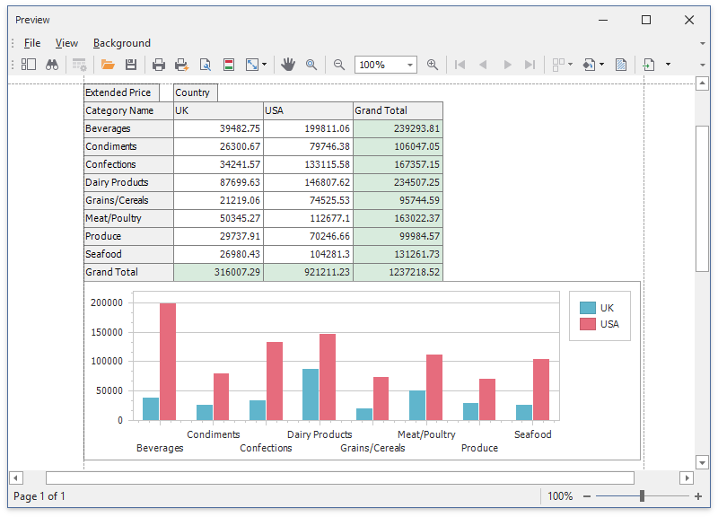

<!-- default badges list -->

<!-- default badges end -->

# WinForms - How to Print a Document that Contains Pivot and Chart Controls

The following example shows how to print a document that contains a Pivot Grid control with an [integrated](https://docs.devexpress.com/WindowsForms/8748/controls-and-libraries/pivot-grid/data-analysis/integration-with-the-chart-control) Chart:

<!-- default file list -->
## Files to look At

* [Form1.cs](./CS/WinformsExport/Form1.cs) ([Form1.vb](./VB/WinformsExport/Form1.vb))
<!-- default file list end -->

## Documentation

* [Integration with the Chart Control](https://docs.devexpress.com/WindowsForms/8748/controls-and-libraries/pivot-grid/data-analysis/integration-with-the-chart-control)

* [How to: Combine Links via the CompositeLink](https://docs.devexpress.com/WindowsForms/174/controls-and-libraries/printing-exporting/examples/using-printing-links/how-to-combine-links-via-the-compositelink?p=netframework)

* [Pivot Charting (Integration with a Pivot Grid Control)](https://docs.devexpress.com/WindowsForms/8695/controls-and-libraries/chart-control/provide-data/pivot-charting-integration-with-a-pivot-grid-control?p=netframework)
